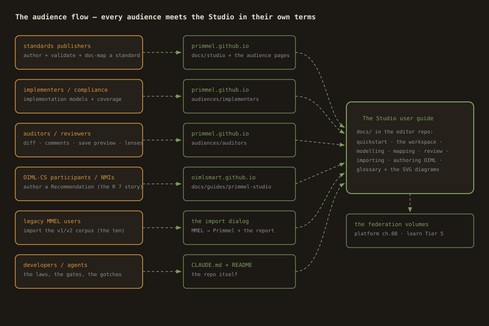
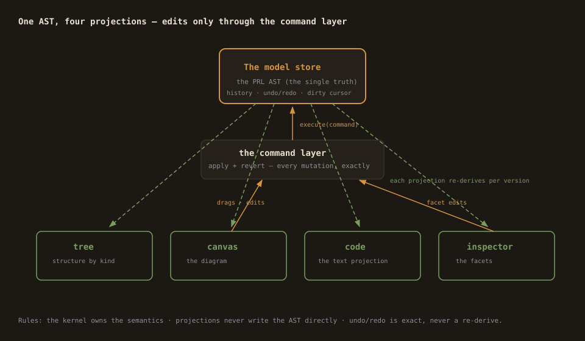

# The Primmel Studio user guide

The manual for Primmel Studio — the authoring tool for the Primmel
modelling language. It is organized by **who you are**: find your row,
start on your page, and reach depth as you need it.



## Who are you?

| You are… | You want to… | Start here | Then read |
|---|---|---|---|
| **a first-timer** | see what this is in 15 minutes | [the quickstart](quickstart.md) | [the workspace](the-workspace.md) |
| **a modeller** (standards author) | create reference models: processes, data, pages | [modelling](modelling.md) | [the workspace](the-workspace.md), [review & save](review-and-save.md) |
| **a compliance engineer** | map your implementation onto reference standards | [mapping](mapping.md) | [review & save](review-and-save.md) |
| **an OIML author** (Recommendation writer, NMI, OIML-CS) | author a full Recommendation package | [authoring OIML](authoring-oiml.md) | [the R 7 tutorial](../demo/r7-clinical-thermometer/TUTORIAL.md) |
| **an auditor / reviewer** | review changes, assert coverage, comment | [review & save](review-and-save.md) | [mapping](mapping.md) (the coverage calculus) |
| **a legacy MMEL user** | bring your v1/v2 .mmel models home | [importing legacy](importing-legacy.md) | [the workspace](the-workspace.md) |
| **a developer / agent** | extend the Studio, respect the laws | [CLAUDE.md](../CLAUDE.md) | [README](../README.md) |
| **an educator** | teach the methodology | [the R 7 tutorial](../demo/r7-clinical-thermometer/TUTORIAL.md) | [authoring OIML](authoring-oiml.md) |

## The shape of the whole thing



Three laws explain everything you will see:

1. **The AST is the single source of truth.** Every edit is a typed
   command (apply + revert) — undo/redo is exact. Tree, canvas, code,
   inspector, mapper, diff are projections of one store.
2. **The kernel owns the semantics.** Parsing, the coverage calculus,
   model-diff, the type vocabulary come from the Primmel kernel — the
   Studio bridges, never reimplements.
3. **Programs plug in, they don't branch the kernel.** The OIML SMART
   layer (the rec palettes, the certificate preview) is a plugin. A
   second 〈scope〉 SMART program plugs the same way.

## The pages

- [quickstart.md](quickstart.md) — the first 15 minutes.
- [the-workspace.md](the-workspace.md) — every surface, with its rules.
- [modelling.md](modelling.md) — the authoring doctrine.
- [mapping.md](mapping.md) — the mapping doctrine (coverage, the lens, automap, documents).
- [review-and-save.md](review-and-save.md) — diff, save, dirty discipline, comments, validation.
- [importing-legacy.md](importing-legacy.md) — the MMEL import.
- [authoring-oiml.md](authoring-oiml.md) — the Recommendation author's guide.
- [glossary.md](glossary.md) — the terms.

## Prove it yourself

Every flow in this guide has a machine-checkable leg:

```bash
cd ~/src/primmel/editor
./e2e/run-all.sh   # 22 legs, each a flow from this guide
npx vitest run     # the unit proofs (144 tests)
```
