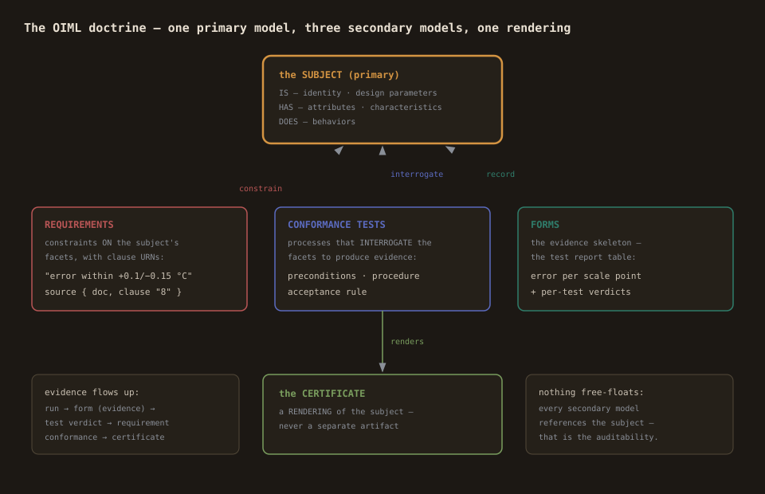

# Authoring an OIML Recommendation — the author's guide

How to author a full OIML Recommendation package with the Studio:
the subject anatomy, the secondary models (requirements, tests,
forms), the doc map, and the certificate preview. The worked example
throughout is OIML R 7 (1979), clinical thermometers — the complete
package ships in `demo/r7-clinical-thermometer/`.

## The doctrine in one picture



**The subject is the primary model.** Requirements are constraints on
the subject's IS/HAS/DOES; tests are processes that interrogate those
facets to produce evidence; forms are the evidence skeleton. They are
secondary models — meaningful only by reference to the subject. The
certificate is a RENDERING of the subject, not an artifact.

## Step 1 — the subject (IS / HAS / DOES)


Declare the instrument as a `subject` — the anatomy:

**IS** — identity and design: what individuates the instrument.

```
is {
  metadata { name "…" intended_use "…" }
  provenance { recommendation "OIML R 7 (1979)" scope "…" }
  design_parameters {
    maximum_permissible_error_high "+0.1 °C (clause 8)"
    maximum_permissible_error_low "-0.15 °C (clause 8)"
    ambient_validity_range "15 °C to 30 °C (clause 8)"
  }
  promises {
    "The mercury column does not recede solely because of cooling (5.4)."
  }
}
```

Design parameters are the type-defining values — the numbers a
certificate will carry. Promises are the manufacturer's claims.

**HAS** — exhibition: what the instrument shows and measures.

```
has {
  attributes {
    graduation_and_numbering "… (clauses 6, 7)"
    inscriptions "the symbol °C near the scale (7.1.1)"
  }
  characteristics {
    error_of_indication "reading minus the conventional true temperature (clause 8, A.3)"
  }
}
```

The characteristic is what a conformance test will MEASURE — declare
it by name; the test binds to it.

**DOES** — behavior: named processes the instrument performs or
undergoes: `IndicateTemperature`, `HoldMaximumReading`,
`BeVerifiedAtScalePoints`.

## Step 2 — requirements with provenance

Each normative clause becomes a `requirement` — a constraint on the
subject — with its clause URN:

```
requirement REQ-MPE {
  name "Maximum permissible errors"
  statement "The error of indication must be within +0.1 °C and −0.15 °C …"
  obligation shall
  limit { expression "error_of_indication >= -0.15 and error_of_indication <= 0.1" }
  source { doc "urn:oiml:pub:r:7:1979" clause "8" }
}
```

The discipline: the `source` facet is not decoration — it is what
makes the model auditable (every claim traceable to its clause).
Machine-checkable limits go in `limit { expression }` when the clause
gives numbers.

Create them through the OIML palette (Requirement) or in code — the
OIML plugin activates automatically when the model carries OIML-CS
content.

## Step 3 — conformance tests and forms

Each annex-A procedure becomes a `conformance_test`:

- `preconditions` — the clause's own validity conditions (the stirred
  bath, the calibrated standard, the ambient range). A test run
  outside its preconditions is void, not failed.
- `procedure` — the numbered steps an operator follows.
- `acceptance_pass_if` — the decision rule in one sentence (or the
  structured acceptance block for the full apparatus).
- `source` — the clause URN, as always.

The `form` is the evidence skeleton — the table the lab fills per
sample (the error table per scale point, the per-test verdicts).
Forms carry no new semantics: they record evidence of tests.

## Step 4 — the verification workflow (simulatable)

Model the lab's flow as a process canvas: receive → examine →
determine errors → test the maximum device → coloration → verdict,
with gates carrying the document's own conditions:

```
E4 { from AmbientValid to ErrorDetermination
  condition "ambient_temperature >= 15 and ambient_temperature <= 30" }
E7 { from WithinMPE to MaximumDeviceTest
  condition "error_of_indication >= -0.15 and error_of_indication <= 0.1" }
```

Registers are the declared variables. The Simulate panel walks the
flow: the conforming path, the invalid-ambient abort (clause 8
validity), and the out-of-MPE fail — exactly the three paths the
clause structure implies.

## Step 5 — the doc map (provenance made bidirectional)

Mapping view → **load document** → the Recommendation's presentation
XML. Map requirements and tests onto the document's statements — the
MPE requirement onto the clause-8 sentence, the error-determination
test onto the A.3 procedure sentences. Pairs land in
`map_profile "urn:oiml:pub:r:7:1979"`.

Now the model points at the document (source facets) AND the document
points at the model (the map profile) — an auditor walks either
direction. The honest caveat: statement ids are ordinal when the
document's titles carry no clause numbers (the R 7 form); semantic
numbers live in `source { clause }`.

## Step 6 — the certificate preview

Topbar → **Certificate preview**: the subject rendered as a
certificate — identity, design parameters (the MPE table), attributes,
promises. This is the author's check that the defining data is
complete: if the preview reads like a certificate, the subject model
is done.

## The author's checklist

- [ ] The subject's IS carries the certificate's defining data
      (preview it).
- [ ] Every requirement has a clause URN and, where the clause gives
      numbers, a machine-checkable limit.
- [ ] Every test has preconditions, a procedure, and an acceptance
      rule — and the workflow simulates all its paths.
- [ ] The doc map resolves (every target exists in the document).
- [ ] The validation badge is green; the package dumps byte-stable.
