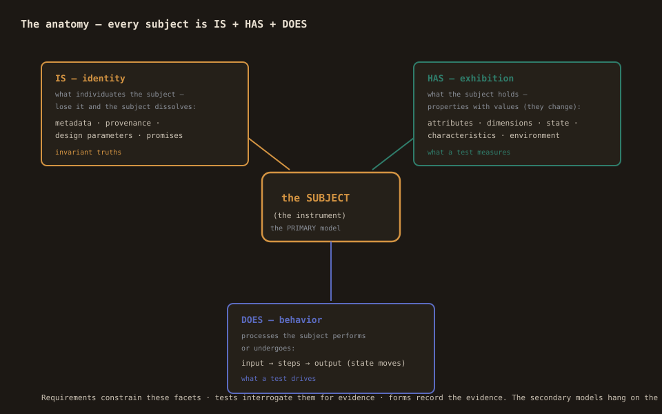

# Glossary — the terms, precisely

The vocabulary of the Studio and the language, in one place. Where a
Primmel term has a legacy MMEL spelling, both are given.

## The modelling system

**IS / HAS / DOES** — the three relations of the modelling system.
IS: identity (what individuates the subject — losing it dissolves the
subject). HAS: exhibition (properties and values the subject holds —
they can change). DOES: behavior (processes the subject performs or
undergoes). Everything else is secondary to these.

**Subject** — the thing modelled. For OIML SMART: the measuring
instrument. The primary model; requirements, tests, and forms are
secondary to it.

**Reference model** — the model of the standard you comply with (its
namespace is its identity in map_profiles). **Implementation model** —
your operations that comply; holds the mapping pairs. The distinction
is a relationship, not a type.

## The language (Primmel, and its MMEL spellings)

**Primmel** — the modelling language and its kernel (parser, linter,
coverage calculus, model-diff). Descendant of MMEL (v1/v2); the
legacy corpus parses natively (see the renames below).

**Construct** — a top-level block of the language (`role`, `process`,
`provision`, `class`, `data_registry`, `variable`, `canvas`,
`comment`, `map_profile`, `subject`, `requirement`,
`conformance_test`, `form`, …).

**The canonical renames** — `measurement` → `variable`,
`subprocess` (a page block) → `canvas`, `view` → `view_profile`.
Inside a process, `canvas`/`subprocess` both mean its page. Note
types `EXAMPLE`/`COMMENTARY` are carried verbatim.

**AST** — the parsed model (the Studio's single source of truth).
**Command** — a typed mutation of the AST (apply + revert; undo/redo
is exact). **Projection** — a view of the AST (tree, canvas, code,
inspector, mapper, diff); projections never write the AST directly.

## Mapping

**MapProfile** — the v3 mapping primitive: a block keyed by the
reference namespace holding `Record<sourceId, MappingPair[]>`.
**Pair** — source id → namespace-qualified target, with description
(how), justification (why), and an optional coverage assertion.

**Coverage levels** — full (green), minimal (teal — the gateway
minimum), partial (amber), none (slate) — computed by the kernel's
coverage calculus over the reference's process tree. **C23** — the
lint that checks an authored coverage assertion against the computed
calculus; the red conflict marker shows asserted ≠ computed.

**The lens** — the multi-reference switcher: view one implementation
through one standard at a time. **Seeding** — starting a new profile
from an existing one (pairs carry only where the target resolves;
the rest is the review list). **Automap** — ranked suggestions with
provenance on confirm, never silent assertions.

## OIML SMART

**Requirement** — a constraint on the subject's IS/HAS/DOES, with a
clause URN (`source { doc, clause }`). **Conformance test** — a
process that interrogates the subject's facets to produce evidence
(preconditions, procedure, acceptance rule). **Form** — the evidence
skeleton (a test report shape). **Certificate** — a rendering of the
subject's defining data (the preview in the OIML plugin).

**OIML-CS** — the OIML certification system (B 18); the program the
OIML SMART layer implements. **NMI** — national metrology institute.

## The run surfaces

**Register** — a variable's value during a simulation or measurement
run. **Ephemeral** — the run stores (simulation registers,
measurement values, mapping rejections): never the AST, never
serialized. The wall is stated on every such panel.

**SSOT** — single source of truth. For the Studio: the AST. For the
platform: the `.prl` packages (downstream trees are generated, never
hand-edited).

**Validation** — the kernel's checks (empty ids, form references,
state-machine cascades, plus parse-time checks) — always visible:
the topbar badge, the Validate tab, the editor markers, the import
report, the save review.
