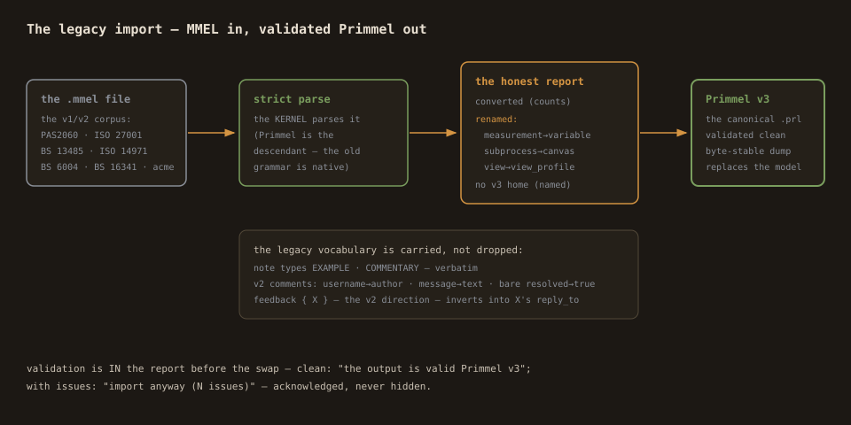

# Importing legacy MMEL — bringing the corpus home

Primmel is the descendant of MMEL — the v1/v2 `.mmel` corpus parses
natively, and the import dialog turns it into validated Primmel with
an honest report. This page is what converts, what renames, and what
to check after.

## The flow

1. Topbar **Import** → choose a `.mmel` file.
2. The report renders **before anything is imported**:
   - **converted** — the construct counts (what the file declares);
   - **renamed** — the legacy spellings the canonical form renames,
     with counts;
   - **no v3 home** — top-level keywords with no Primmel construct
     (named, never silently dropped — empty for the whole known
     corpus);
   - **validation** — the kernel's verdict on the converted model
     (clean states: the output is valid Primmel v3).
3. Confirm: **import as Primmel (.prl)** — or, when the validation
   has issues, **import anyway (N issues)** (acknowledged, never
   hidden). The working model is REPLACED — the dialog says so.

## What converts (the proven corpus)

All ten legacy files in the SMART-documentation corpus convert clean,
validator-accepted, byte-stable through the canonical dump — pinned
in the test matrix with their exact counts:

| file | processes | provisions | roles | pages | dataclasses | refs | notes | views | comments |
|---|---|---|---|---|---|---|---|---|---|
| acme | 14 | 5 | 6 | 3 | 13 | 18 | 2 | 0 | 0 |
| bs13485 (-2012) | 376/377 | 438/439 | 9 | 98 | 33 | 90 | 8/9 | 3 | 0 |
| bs16341 | 23 | 32 | 2 | 1 | 5 | 4 | 0 | 0 | 0 |
| bs6004 | 105 | 117 | 1 | 32 | 0 | 40 | 35 | 0 | 0 |
| iso14971 (+dev3) | 59 | 84 | 2 | 18 | 17 | 19 | 38 | 0 | 3/0 |
| iso27001 | 262 | 320 | 4 | 77 | 23 | 198 | 0 | 0 | 0 |
| iso27001 plugin | 43 | 17 | 0 | 9 | 0 | 0 | 0 | 0 | 0 |
| pas2060 plugin | 56 | 100 | 3 | 10 | 14 | 49 | 0 | 0 | 0 |

## The renames (the canonical spellings)

The legacy spellings parse and re-emit in the canonical form; the
report names every one with counts:

- `measurement X { }` → `variable X { }` (the v3 keyword);
- `subprocess Page { }` → `canvas Page { }` (the page block);
- `view X { }` → `view_profile X { }` (the v2 view block).

Inside constructs, the mapping is silent by design (same meaning):
`canvas`/`subprocess` inside a process both mean its page;
`signal_catch_event` is the signal event.

## The legacy note types and comment forms

- Note types `EXAMPLE` and `COMMENTARY` parse and re-emit verbatim
  (the corpus carries them — the language accepts its ancestry).
- The **v2 comment forms** map into the v3 shape:
  `username` → author, `message` → text, the bare `resolved` flag →
  `resolved true`, and `feedback { X }` — the v2 direction (X responds
  TO this comment) — inverts into `X`'s `reply_to` link. The
  inversion is done by the kernel's resolver, and the round trip is
  byte-stable.

## After the import

1. **Read the validation badge** — the converted model validates like
   any other (the import report already showed it).
2. **Diff it** — load the original `.mmel` as the diff's other side to
   review exactly what the canonicalization changed (the renames,
   nothing else).
3. **Save as `.prl`** — the model is Primmel now; the extension and
   the canonical form are the artifact.

## If something has no v3 home

The report's **no v3 home** section lists any top-level keyword the
kernel doesn't know, with counts — nothing is ever silently dropped.
If you hit one: the model did NOT import those constructs (the rest
came through); bring the list to the kernel maintainers (the fix is a
construct registration upstream, as it was for `view`, `EXAMPLE`,
`COMMENTARY`, and the v2 comment forms).
