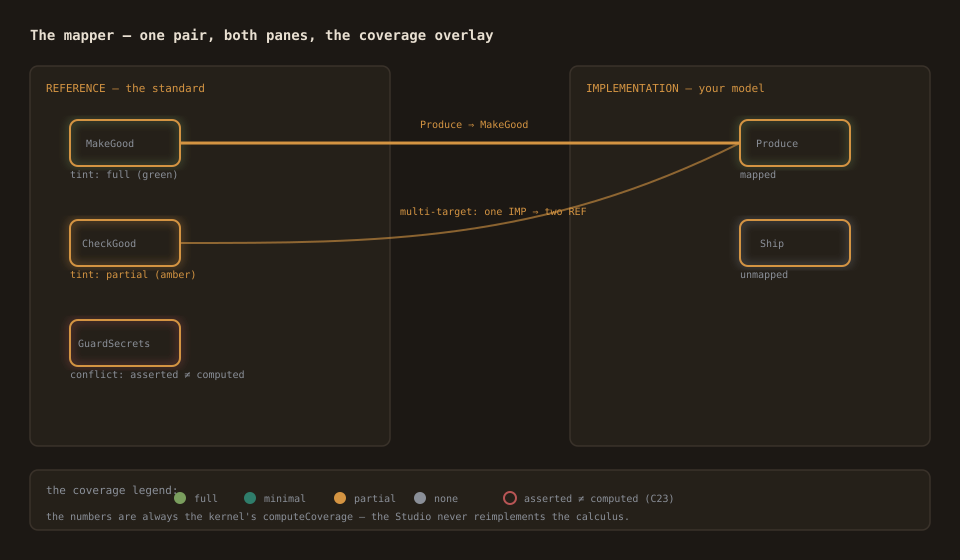
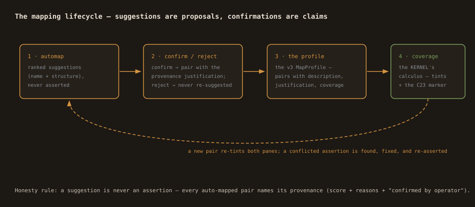
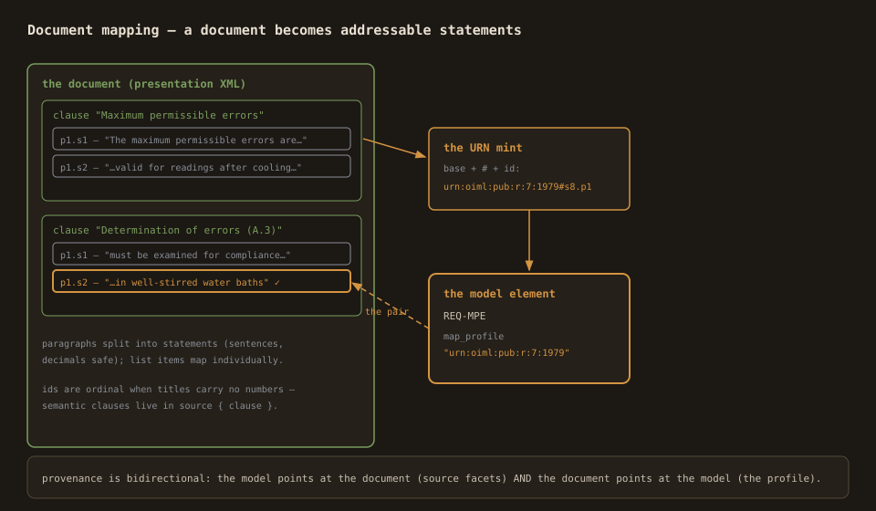

# Mapping — the mapping doctrine

The mapper is where two models meet: the reference (the standard you
comply with, or a document) and your implementation. This page is the
full doctrine: pairs, the coverage calculus, the multi-reference lens,
automap, and document mapping.



## The MapProfile (what a mapping IS)

A mapping is a set of **pairs** held by the IMPLEMENTATION model, in a
`map_profile` block keyed by the reference's namespace:

```
map_profile QMS {
  mapping {
    Produce -> QMS#MakeGood { description "how the fulfilment works" justification "why the claim holds" coverage full }
  }
}
```

- **source** — the implementation element id.
- **target** — the reference element, namespace-qualified (`QMS#…`,
  or a statement URN for documents).
- **description / justification** — the claim's how and why. They are
  the point: a pair without its meta is an assertion without a reason.
- **coverage** — an optional per-pair assertion (full / minimal /
  partial / none), checked against the calculus (C23).

**Multi-target is first-class**: one implementation element may map to
several reference targets ("write once, comply twice"), and one
reference target may receive several sources. The profile is a list
per source, never a single link.

## The coverage calculus (the kernel's numbers)

The tints on both panes come from the KERNEL's `computeCoverage` —
the Studio never recomputes:

- **full** (green) — the component is covered (mapped, or all of its
  children covered).
- **minimal** (teal) — the gateway minimum: at least one branch
  covered (a `child_composition gateway` parent).
- **partial** (amber) — some children covered.
- **none** (slate) — uncovered.

Hover a parent: the tooltip shows the aggregation basis (the rule and
the children's levels). IMP side: mapped (a resolving pair exists)
vs unmapped.

**The C23 conflict marker** (red): where the profile asserts a
coverage level that disagrees with the calculus, the node shows the
conflict with both values — asserted vs computed. Assertions are
claims; the calculus is the check.

## The multi-reference lens

Register several reference models (load reference repeatedly) — each
gets a badge in the switcher. **The auditor looks through ONE standard
at a time**: swapping the lens re-renders the REF pane, the edges, and
the coverage against that standard's profile only. Your implementation
shows per-element badges listing every namespace it maps into.

**Seeding**: starting a profile for a new reference from an existing
one ("start 27001 from the 9001 mappings") — pairs carry over only
where the target id resolves in the target reference; the rest is the
**review list**, shown, never silently dropped. The whole seed is one
undo unit.

## Automap (suggestions, never assertions)

The automap panel ranks suggestions: name similarity (prefix-aware
token overlap + edit distance) with structural bonus (process
input/output overlap, dataclass attribute overlap).

- **Confirm** lands the pair with the provenance justification:
  `auto-suggested (score …: name …, structure …), confirmed by operator`.
  The claim's origin is never hidden.
- **Reject** remembers for the session — never re-suggested.
- The kernel's own **closure proposals** (all children covered ⇒ the
  parent is proposed) appear flagged as proposals — confirming them
  asserts a direct mapping.



## Document mapping (elements ↔ statements)



The reference side can be a **document** (a Metanorma presentation XML
from the corpus, or plain text). The Studio parses it into clauses →
paragraphs → statements with stable ids, and the statements become
mapping targets with URNs — `urn:oiml:pub:r:60-2:2021#2.10.1.p1.s1`
where resolvable, else a doc-local id.

- Sentences split at boundaries (decimals safe); list items map
  individually.
- The statement ids are document-order ordinals when the document
  carries no clause numbers in its titles (the R 7 form) — semantic
  clause numbers belong in the model's `source { clause }` facets.
- Pairs land in a `map_profile` keyed by the document's URN — the
  same shape as model mapping, so the overlay and the party lists
  work unchanged. (A document has no process tree, so the coverage
  overlay stays off in doc mode.)

## The habits

- **Map with the meta.** The description and justification ARE the
  claim. An empty pair is a checkbox; a reasoned pair is compliance.
- **Read the conflict marker as homework, not noise.** Asserted ≠
  computed means someone claimed coverage the structure doesn't
  deliver.
- **One standard per lens.** Multi-standard integration lives in the
  implementation model; each reference keeps its own profile — no
  merged claims.
