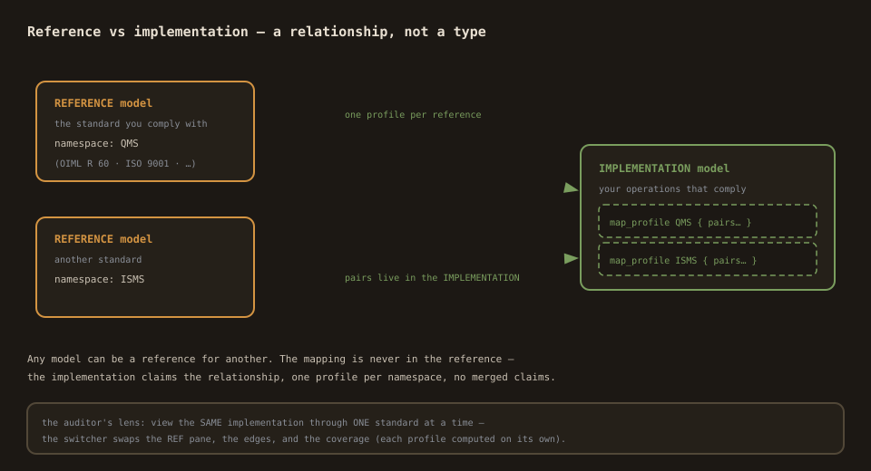
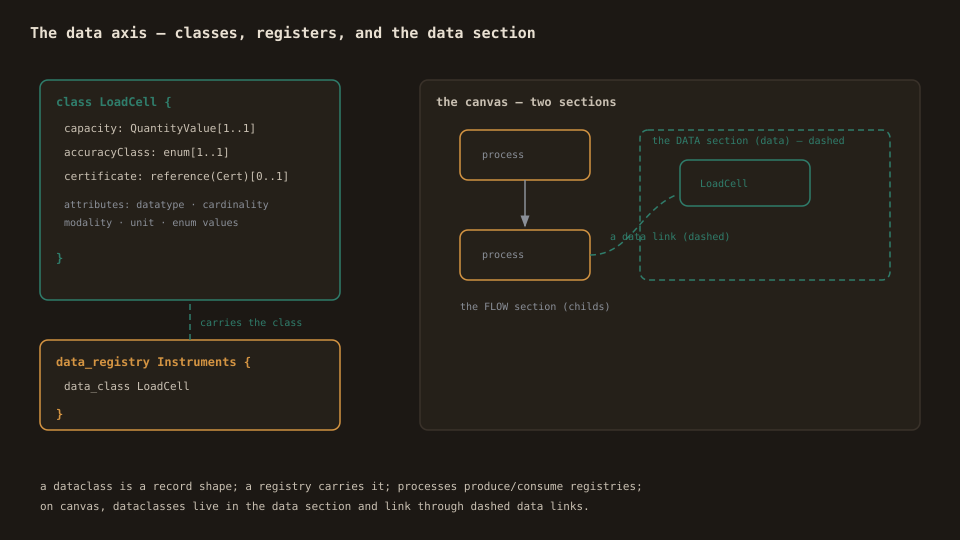
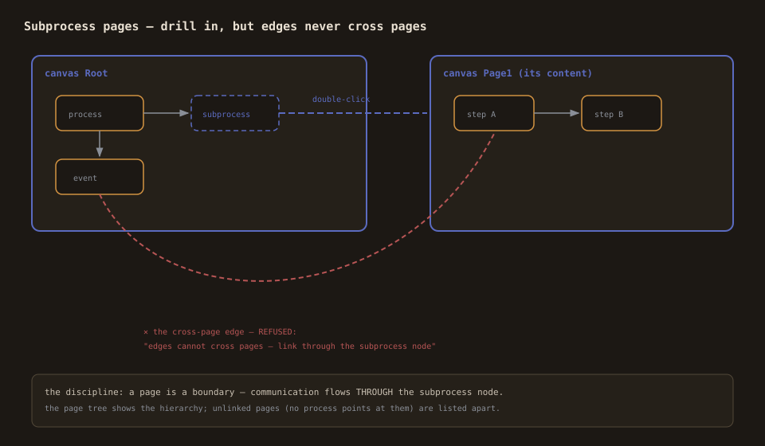

# Modelling — the authoring doctrine

How to build a Primmel model in the Studio: what a model IS, the three
starting points, and the four structural tools (processes, data,
pages, variables).

## What a model is

A Primmel model is a `.prl` text — a set of constructs the kernel
parses into one AST: roles, provisions, processes, approvals,
dataclasses, registries, enums, variables, events, gateways, canvas
pages, references, notes, comments, and (for program layers) the
domain constructs (subjects, requirements, conformance tests, forms).
The Studio edits exactly that AST — nothing else exists behind it.

The three starting points (New):

- **Blank** — the minimal working model.
- **Reference** — the standard you comply with. Its namespace is its
  identity in every map_profile that will point at it.
- **Implementation** — your operations that comply. It carries a note
  pointing at the Mapping view; the pairs it will hold land in its own
  `map_profile` blocks.

**Reference vs implementation is a relationship, not a type.** Any
model can be a reference for another. An implementation maps onto one
or more reference models — each mapping is a separate profile keyed by
the reference's namespace.

## Processes and facets

A process is a step with facets: name, actor (a role), modality
(SHALL/SHOULD/MAY), validate_provision (the provisions it fulfils),
output/input registries (what it produces/consumes), measurements
(the variables a run records), and optionally a **subprocess page**
(its drill-down content).

In the Studio:

- Create processes from the palette; edit facets in the inspector.
- Nested processes (children) declare composition — the model tree
  shows the hierarchy; `child_composition gateway` means "at least one
  child" (the coverage calculus's gateway-minimum rule).
- Approvals are process-like sign-offs (actor applies, approver
  approves); events mark entry/exit/timer/signal; gateways branch
  (exclusive = condition-driven, parallel = all branches).

## Data registers and dataclasses (the HAS axis)

- A **dataclass** is a record shape: attributes with datatype (the
  kernel's vocabulary — primitives, QuantityValue, `reference(Class)`,
  `map<K,V>`), cardinality (`0..1`, `1..1`, `0..*`, `1..*`),
  modality, unit, required flag, inline enum values, satisfy links,
  and document references.
- A **data_registry** carries a dataclass (its `data_class` link) —
  the register the process's `output { }` / `reference_data_registry
  { }` facets point at.
- On the canvas, dataclasses live in the page's **data section**
  (dashed nodes); a process ↔ dataclass edge renders as a dashed data
  link.

The Studio edits all of it: the tree's `+` creates dataclasses,
registries, enums; the inspectors edit attributes, enum values, the
registry's title and data_class; the datatype selector offers the
kernel's vocabulary plus `reference(…)` targets from your own classes.

## Subprocess pages (drill in and out)

A process can own a **page** — its drill-down canvas:

1. Select the process → the inspector's **subprocess page** field →
   **+ page** (creates and links in one command) or pick an existing
   page.
2. **open →** (or double-click the node) to descend; add nodes inside
   like on the root.
3. The breadcrumb walks back up; the page tree shows the hierarchy.

The discipline: **edges never cross pages.** Communication flows
through the subprocess node — the canvas refuses cross-page connects
and says why. Pages with no linker are listed as unlinked in the page
tree (legal, serializable, but dead weight).

## Variables and measurements

- **Variables** declare typed run values (integer, float, boolean,
  date, datetime…). The process's `validate_measurement` facet names
  the variables a run records.
- The **measurement panel** (below the inspector) turns that facet
  into rows: value + unit + uncertainty per point, with the verdict
  chip (missing / type mismatch / valid) and the formatted result.
  The wall is stated: run values are evidence-adjacent, never model
  content — the panel writes to an ephemeral store, never the AST.
- The **simulation** uses the same variables as gate registers: an
  exclusive gateway's edge conditions evaluate over them
  (`temperature > 36`, `error >= -0.15 and error <= 0.1`). Edit a
  register at a blocked gate and step again.

## The habits that keep models honest

- **Every element has a stable id.** Renames are rare and explicit
  (pages rename through the page tree, updating every placement and
  edge).
- **Every edit is undoable.** The history is the audit trail; the
  dirty dot means "you have unreviewed changes".
- **The validation badge is always on.** A clean badge is not optional
  polish — it is the kernel telling you the model is coherent. When
  it flags, the Validate tab names the issue and clicking it selects
  the element.
