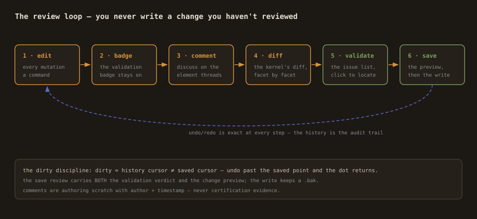
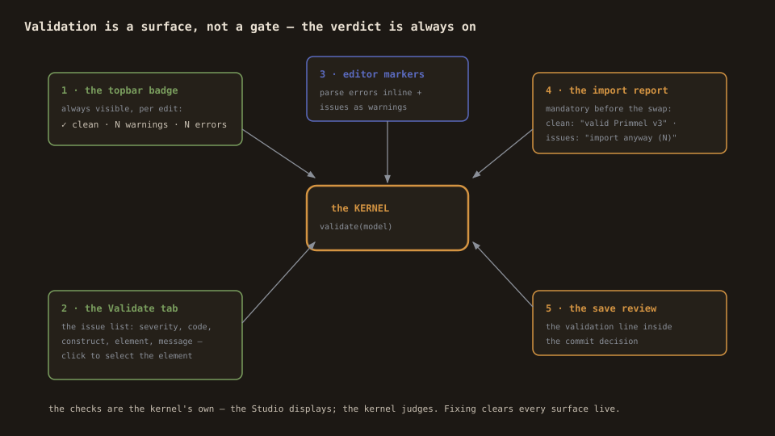

# Review & save — the commit discipline

The Studio's rule: **you never write a change you haven't reviewed.**
This page covers the model-diff view, the save preview, the dirty
discipline, comments, and the validation surface — the review loop
end to end.

## The model-diff view (the version compare)

Topbar → **Diff**: your working model on one side, any `.prl` you load
on the other (swap ⇄ flips the direction). The comparison is the
kernel's `diffStandards` — never a Studio recomputation:

- **The summary**: `+added −removed ~changed ⇢moved` (+ the mapping
  diff counts when profiles exist).
- **The changed-element list**, grouped by status: each row expands
  to the facet-level before/after (the statement facet of a renamed
  process, the anchor of a moved one).
- **The mapping diff**: added/removed/changed pairs and the coverage
  delta per component.
- **The canvas, tinted by status**: added green, removed red, changed
  amber, moved blue — the spatial review of the same diff.

## The save review (review-before-commit)

Ctrl+S (or the Save button — its dot means unsaved changes). The
panel shows:

1. **The validation line** — the kernel's verdict on the model you
   are about to write (clean, or N errors/warnings with a pointer to
   the Validate tab).
2. **The change preview** — the diff against your loaded original
   (the same kernel diff, against the last load or last save), with
   the changed rows listed.
3. **The write** — download the `.prl` (the honest browser path), or
   write to a project-relative path through the dev server, which
   keeps a `.bak` of what it overwrites. Paths into
   `primmel-packages/` surface the regen note: authored packages
   regenerate their downstream trees (`npm run gen:data` in the app).

After the write, the dirty flag clears and your working point becomes
the next diff's baseline.

## The package save (the unit of work is a directory)

When you opened a v3 **package** (the Open pkg dialog), the save splits
the merged model back into its source files — the kernel's provenance
load attests which file every construct came from, down to its byte
span. The panel lists one row per file to be written; untouched files
are never touched.

The write is **comment-true**: a touched file is not re-dumped into
canonical form. Its authored bytes carry over verbatim — the comment
banners, the clause provenance, the whitespace style, the construct
order — and only the edited constructs' own spans are replaced (a
changed construct rewrites to its canonical form, a removed one drops
out with its line ending, a new one appends to its kind's home file).
The guarantee the SSOT doctrine needs: `git diff` after a save shows
exactly the constructs you edited, nothing else. Constructs owned by
imported packages are surfaced in the plan but never written; the
manifest (`package.primmel`) rewrites canonically when it changes.

A successful write re-bases the session's provenance onto the new
bytes, so the next save in the same session splices the new state —
undo history and all.

## The dirty discipline

Dirty = the history cursor ≠ the saved cursor. Since every edit is a
command, dirty is exact: undo past the saved point and the dot
returns; redo to it and it clears. Closing the tab with unsaved
changes warns.

## Comments (the review conversation)

Select any element; the comment panel shows its thread: add, reply,
resolve/unresolve, delete (a root takes its replies — never orphaned).
The canvas badge counts unresolved comments per node. Comments
serialize as PRL `comment` constructs — they travel with the model —
and carry author + timestamp. The audit posture is stated on the
panel: **comments are authoring scratch, never certification
evidence.**

## The validation surface (the continuous check)

Validation is not a gate at the end; it is a surface that is always
on:

- **The topbar badge** — the kernel's verdict per edit.
- **The Validate tab** — the issue list with severity, code,
  construct, element, message; click to select the element.
- **The code editor markers** — the same issues inline.
- **The import dialog** — the converted model's validation is
  mandatory in the report before the swap (clean states: the output
  is valid Primmel v3; with issues, the button reads "import anyway
  (N issues)" — acknowledged, never hidden).
- **The save review** — the validation line inside the commit
  decision.

The checks are the kernel's own (empty ids, form references,
state-machine cascades, plus parse-time checks like duplicate ids and
unknown keywords in strict mode). The Studio displays; the kernel
judges.

## The loop, in one line

Edit → the badge stays honest → comment what needs discussion →
review the diff → validate → save with the preview. Undo/redo is
exact at every step.
