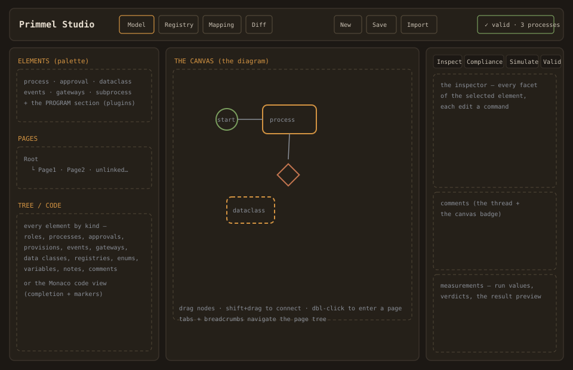
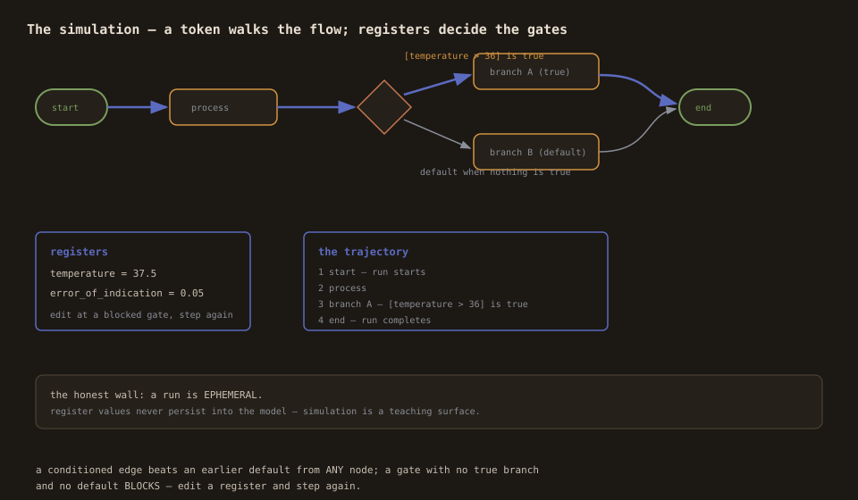

# The workspace — every surface, with its rules

The Studio is one workspace with four projections of a single model
store. This page walks every surface in the layout and states the
rules that hold there.

## The topbar

- **The view switcher** — Model / Registry / Mapping / Diff. Model is
  the editing workspace; Registry is the data-registry table; Mapping
  is the REF⇄IMP mapper; Diff is the version compare.
- **The model stats** — processes / provisions / canvases counts, and
  the **validation badge**: the kernel's `validate()` verdict on the
  live model, recomputed per edit. Green ✓ clean, amber warnings, red
  errors (with the count). A parse error replaces it with `!`.
- **New / Save / Import** — the file flows (new model templates, the
  save review, the legacy import). Plugin panels (e.g. the OIML
  certificate preview) sit beside them when a program is active.
- **Ctrl+N** new · **Ctrl+S** save · closing with unsaved changes
  warns (dirty = the history cursor ≠ the saved cursor).

## The left panel

- **The palette** — create elements: process, approval, dataclass,
  start/end/timer/signal events, exclusive gateway, subprocess page.
  Click to add at the viewport center, or drag onto the canvas. The
  **Program** section below it appears only when a plugin matches
  (e.g. the OIML palettes: requirement, conformance test, form,
  instrument).
- **The page tree** — the subprocess-page hierarchy from the root,
  with create (`+`) and inline rename. Pages no process links to are
  listed apart as **unlinked** (legal, but dead weight until linked).
- **Tree / Code tabs** — the model tree (every element by kind, with
  group-level `+` for dataclasses, registries, enums) or the Monaco
  code editor.

## The canvas (the diagram)

- **Drag** a node to move it (the position commits as a command).
- **Shift+drag** from node to node to connect. The connection
  discipline, enforced at release with a visible refusal banner:
  no self-loops, no exact duplicates ("those nodes are already
  connected"), no cross-page edges ("link through the subprocess
  node"), no edges to elements not on the current page.
- **Edge conditions** — click an edge to edit its condition (the
  simulation's branching expressions) or delete it (the ✕).
- **Double-click** a process with a page (or a subprocess node) to
  descend; the breadcrumb (`Root / Page1 / …`) walks back up; page
  tabs switch directly.
- **Dataclasses live in the data section** — dashed nodes; edges to
  them render as dashed data links.
- **Tints and badges** — external overlays glow on the nodes: the
  coverage overlay (the mapper), the diff status (the diff view), the
  current step (the simulation), the comment badge (unresolved count).

## The right panel

Four tabs, one panel:

- **Inspect** — the facet editor for the selected element. Per type:
  process (name, actor, modality, provisions, output/input registries,
  measurements, subprocess page), approval (actor + approver), event
  (type + signal/timer parameters), gateway (type + label), subprocess
  (page stats), dataclass (store, extends, description, the attribute
  list with datatype/cardinality/modality/enum values/references),
  registry (title + data_class), enum (the value list).
- **Compliance** — the provision list with the modality filter.
- **Simulate** — the run controls: start/step/continue/reset/stop, the
  register table (edits unblock gates), the trajectory log. The wall
  is stated on the panel: **a run is ephemeral — register values never
  persist into the model.**

- **Validate** — the kernel's issues on the live model: severity
  chips, the issue list (code, construct, element, message), click an
  issue to select the offending element. Fixing clears it live.

Below the inspector: **comments** (the selected element's thread —
add, reply, resolve, delete; the audit note: comments are authoring
scratch, never certification evidence) and **measurements** (the
selected process's declared measurement points: value + unit +
uncertainty rows with the verdict chip and the result preview — run
values, never model content).

## The code editor (Monaco)

- **Syntax highlighting** for the PRL grammar.
- **Completion from the live model**: roles after `actor `, provisions
  inside `validate_provision { }`, registries inside `output { }`,
  pages after `subprocess `, dataclasses after `data_class `,
  datatypes after an attribute's `:` (the kernel's type vocabulary +
  QuantityValue + `reference(Class)`), construct keywords anywhere
  else.
- **Validation markers** — parse errors inline with the kernel's
  message; after a clean parse, the kernel's validation issues as
  warnings.
- **The single-writer discipline** — text edits re-parse into the AST
  (the AST is untouched until the text parses); canvas edits rewrite
  the text byte-clean with the cursor preserved.

## The overlays (Mapping / Diff)

- **Mapping** — REF pane (reference model or a document), IMP pane
  (your model), the overlay edges between them, the coverage legend,
  automap suggestions, party lists, the profile switcher (the
  multi-reference lens). The full doctrine: [mapping](mapping.md).
- **Diff** — the version compare: the summary (+/−/~/⇢), the grouped
  changed-element list with facet-level before/after, the mapping
  diff, and your model tinted by status. The save review uses the
  same kernel diff against your loaded original.
